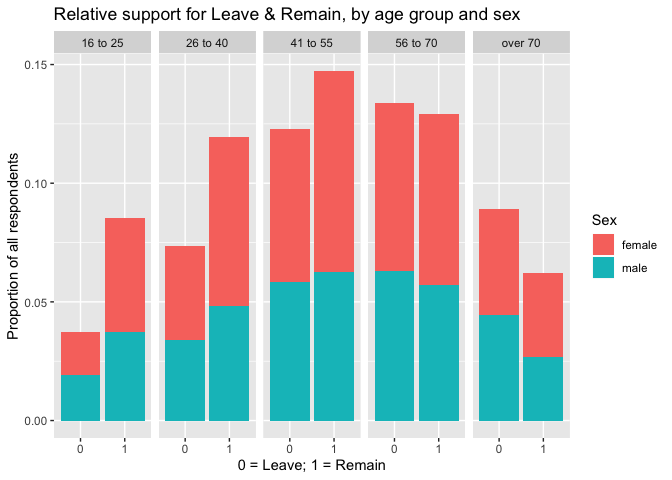

Statistical assignment 1
================
jjm230 - 680003775
29/01/2020

Open data (10 points)
---------------------

In this assignment you will work with the individual level data from wave 8 of the Understanding Society survey. First, you need to open the data set. Please complete the code below.

``` r
library(tidyverse)                                      # Attach tidyverse
```

    ## ── Attaching packages ────────────────────────────────────────────────────────────────────────────────── tidyverse 1.3.0 ──

    ## ✓ ggplot2 3.2.1     ✓ purrr   0.3.3
    ## ✓ tibble  2.1.3     ✓ dplyr   0.8.3
    ## ✓ tidyr   1.0.0     ✓ stringr 1.4.0
    ## ✓ readr   1.3.1     ✓ forcats 0.4.0

    ## ── Conflicts ───────────────────────────────────────────────────────────────────────────────────── tidyverse_conflicts() ──
    ## x dplyr::filter() masks stats::filter()
    ## x dplyr::lag()    masks stats::lag()

``` r
Data <- read_tsv("~/Documents/Exeter/Q-Step/POL2094 Data Analysis in Social Science III/Data III Project/Data III Project/data/UKDA-6614-tab/tab/ukhls_w8/h_indresp.tab") # Load data
```

    ## Parsed with column specification:
    ## cols(
    ##   .default = col_double()
    ## )

    ## See spec(...) for full column specifications.

Now you have got your data frame stored as Data.

Select variables (10 points)
----------------------------

The data for Wave 8 of the Understanding Society were collected in 2016-18. Among other things, people were asked the following question: "Should the United Kingdom remain a member of the European Union or leave the European Union?" In this assignment, we will explore how answers to this question depend on sex and age.

First, you need to select the variables for the analysis. You want to keep the following variables: cross-wave individual identifier (*pidp*), support for the UK remaining or leaving the EU (*h\_eumem*), sex (*h\_sex\_dv*), age (*h\_age\_dv*), and sample origin (*h\_memorig*).

Complete the code below to select those variables from the data frame and save the result.

``` r
Data <- Data %>%           # Create 'Data' from 'Data', by                             
        select(pidp,       # selecting pidp, and
               h_memorig,  # h_memorig, and
               h_eumem,    # h_eumem, and
               h_sex_dv,   # h_sex_dv, and
               h_age_dv    # h_age_dv
               )
```

Filter observations (10 points)
-------------------------------

To make nationally representative estimates from the Understanding Society data we would need to use weight coefficients. There are many different types of weight coefficients that can be used depending on the question and the level of analysis (see the User Guide, pp. 65-71). We will not do this in this assignment. However, what we want to do is to keep data from the original Understanding Society sample only (ukhls gb 2009-10), dropping data for Northern Ireland, the BHPS cohort members and ethnic minority boost samples. This will make data closer to be representative for Great Britain. You need to choose the observations where *h\_memorig* has the value of 1.

``` r
Data <- Data %>%             # Create 'Data' from 'Data', by 
        filter(h_memorig==1  # filtering for obs. wherein h_memorig equals 1
               )
```

Recode data (20 points)
-----------------------

Let us tabulate the variables for EU support, sex, and age.

``` r
table(Data$h_eumem)
```

    ## 
    ##    -9    -8    -7    -2    -1     1     2 
    ##    33   482   879   354   753 11118  9338

``` r
table(Data$h_sex_dv)
```

    ## 
    ##     0     1     2 
    ##     1 10470 12486

``` r
table(Data$h_age_dv)
```

    ## 
    ##  16  17  18  19  20  21  22  23  24  25  26  27  28  29  30  31  32  33  34  35 
    ## 284 309 290 291 278 295 268 326 287 257 243 234 229 249 274 278 278 293 314 332 
    ##  36  37  38  39  40  41  42  43  44  45  46  47  48  49  50  51  52  53  54  55 
    ## 351 332 321 336 320 327 368 404 372 386 435 465 425 447 406 420 427 414 432 422 
    ##  56  57  58  59  60  61  62  63  64  65  66  67  68  69  70  71  72  73  74  75 
    ## 408 413 416 434 369 398 358 399 354 412 345 358 412 434 431 334 326 293 275 251 
    ##  76  77  78  79  80  81  82  83  84  85  86  87  88  89  90  91  92  93  94  95 
    ## 219 231 211 205 181 162 138 117 117 108  89  78  77  48  41  27  15  18  15   7 
    ##  96  97  98  99 101 102 
    ##   6   2   3   1   1   1

You will see that all these variables are numeric. You can learn what the numeric codes mean by checking the codebook here: <https://www.understandingsociety.ac.uk/documentation/mainstage/dataset-documentation/datafile/indresp/wave/8> .

We want to do the following:

1.  Recode the variable for EU support as binary (1 for Remain, 0 for Leave), coding all types of missing values (including refusals and "don't know") as NA.
2.  Recode sex into a character vector with the values "male" or "female".
3.  Recode age into a variable with the following categories: 16 to 25, 26 to 40, 41 to 55, 56 to 70, over 70.

In all cases, we want to create new variables.

``` r
Data <- Data %>%                                                  # Create 'Data' from 'Data', and then
        mutate(EU = recode(h_eumem,                               # create a new var. 'EU', defined as a recode of h_eumem, where
                           `1` = 1,                               # 1 becomes 1, and
                           `2` = 0,                               # 2 becomes 0, and
                           .default = NA_real_                    # all others become NA
                           )) %>%                                 # and then,
        mutate(sex = recode(h_sex_dv,                             # create a new var. 'sex', defined as a recode of h_sex_dv, where
                            `1` = "male",                         # 1 becomes male
                            `2` = "female",                       # 2 becomes female
                            .default = NA_character_              # all others become NA
                            )) %>%                                # and then,
        mutate(agegr = case_when(                                 # create a new var. 'agegr', defined as a case when
                        between(h_age_dv, 16, 25) ~ "16 to 25",   # ages 16-25 become category "16 to 25", and
                        between(h_age_dv, 26, 40) ~ "26 to 40",   # ages 26-40 become category "26 to 40", and
                        between(h_age_dv, 41, 55) ~ "41 to 55",   # ages 41-55 become category "41 to 55", and
                        between(h_age_dv, 56, 70) ~ "56 to 70",   # ages 56-70 become category "56 to 70", and
                        h_age_dv > 70 ~ "over 70"                 # ages greater than 70 become category "over 70"
        ))
```

Summarise data (20 points)
--------------------------

Let us **dplyr** to calculate how many people in the sample supported Remain and Leave, both as absolute numbers and percentages.

``` r
Data %>%                                 # Call 'Data', and then
        dplyr::count(EU) %>%             # count the obs. by group, and then
        dplyr::mutate(freq = n / sum(n)) # create another column, where values are groups' relative frequencies
```

    ## # A tibble: 3 x 3
    ##      EU     n  freq
    ##   <dbl> <int> <dbl>
    ## 1     0  9338 0.407
    ## 2     1 11118 0.484
    ## 3    NA  2501 0.109

Write a couple of sentences with the interpretation of this result. How this compares with the result of the 2016 referendum? Why?

A: The data clearly show a preference for remaining a member of the European Union, with almost 2,000 more respondents (representing an 8% point increase) stating as such. However, this is clearly in conflict with the result of the referendum, wherein 54% of the participating electorate voted to leave the EU. There are numerous possible explanations for this conflict: (1) the data include 16-17 year olds, who generally preferred to remain in the EU but could not vote in the referendum; (2) the ~11% of respondents whose data are missing could mask a preference for leaving the EU, and (3) the field work was carried out both before and after the referendum result took place, and so some leave voters may have changed their opinions in that time, generating the data shown.

Summarise data by sex and age (30 points)
-----------------------------------------

Now let us look at the support for Leave and Remain by sex and age. Use your newly created variables.

``` r
gg1 <- as.data.frame(table(Data$agegr, Data$sex, Data$EU)) %>%           # Create 'gg1' as a data frame of the table of the variables "agegr", "sex", and "EU" from within 'Data', and then
  mutate(rel.Freq = recode(Freq,                                         # Add an additional var. 'rel.Freq' defined as the recoding of var. 'Freq',
                           .default = Freq/sum(Freq)                     # Where every ob. is its proportion of the total.
                           ))
library(reshape2)                                                        # Attach reshape2 (for melt function)
```

    ## 
    ## Attaching package: 'reshape2'

    ## The following object is masked from 'package:tidyr':
    ## 
    ##     smiths

``` r
gg1 <- reshape2::melt(gg1)                                               # Convert gg1 into a molten data frame.
```

    ## Using Var1, Var2, Var3 as id variables

``` r
gg1.rel.Freq <- subset(gg1, subset = variable == "rel.Freq")             # Create 'gg1.rel.freq', defined of a subset of gg1 wherein only obs. taking 'rel.Freq' under var. 'variable' are included.
ggplot(gg1.rel.Freq,                                                     # Create a ggplot canvass drawing from 'gg1.rel.Freq', where
       aes(x=Var3,                                                       # an x-axis is created from var. 'Var3', and
           y=value,                                                      # a y-axis is created from var. 'value', and
           fill=Var2                                                     # data are stratified by categories within var. 'Var2'
           )) +                                                          # add another ggplot layer:          
    geom_bar(stat='identity',                                            # create a bar chart wherein the heights of bars are taken from the data, and
             position='stack'                                            # stratified categories are stacked
             ) +                                                         # add another ggplot layer:
    facet_grid(~ Var1                                                    # form a matrix of panels from var. 'Var1' as the faceting var. 
               ) +                                                       # add another ggplot layer:
    ggtitle("Relative support for Leave & Remain, by age group and sex"  # include the title within ""
            ) +                                                          # add another ggplot layer:
    labs(x="0 = Leave; 1 = Remain",                                      # overwrite default labels with the x-axis taking the text within "", and
         y="Proportion of all respondents",                              # the y-axis taking the text within "", and
         fill="Sex"                                                      # the legend title taking the text within ""
         )
```

 Write a couple of sentences interpreting your results. A: It is clear that age and support for Leave are positively correlated, although Leave does not achieve a majority until the 56-70 age group; support for Remain and age are thus negatively correlated. However, there are also larger majorities within age groups further away from the inter-quartile range. By contrast, sex does not appear to be an influential variable, with an approximately even split for Leave voters, while women form a slim majority of Remain voters.
